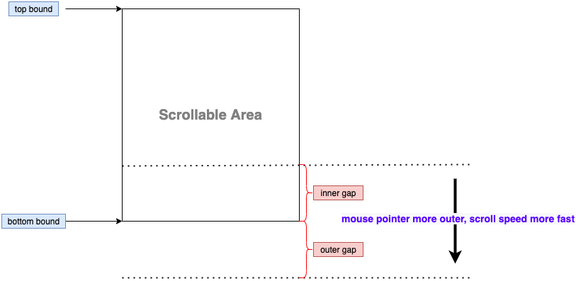

# auto-scroll-while-dragging

[](https://npm.im/auto-scroll-while-dragging) [](https://npm.im/auto-scroll-while-dragging)

This package is used to enhance the auto-scrolling behavior while dragging.

Why? Because the browser native auto-scrolling behavior is uncontrollable or even not working, especially on safari browser.

Talk is meaningless, please [check the demo](https://auto-scroll-while-dragging.vercel.app/) by using different browsers.

## Get Started

```sh
npm i auto-scroll-while-dragging
yarn add auto-scroll-while-dragging
pnpm add auto-scroll-while-dragging
```

- For normal use, just run the function with your options

```jsx
import { autoScrollWhileDragging } from 'auto-scroll-while-dragging';

autoScrollWhileDragging({
  rootEl: document.body,
  gap: 150,
});
```

- For react SSR use, put it inside useEffect and don't forget to clear effects

```jsx
import { autoScrollWhileDragging } from 'auto-scroll-while-dragging';

function MyComponent() {
  useEffect(() => {
    let unbind = autoScrollWhileDragging({ rootEl: document.body, gap: 150 });
    return () => unbind();
  }, []);

  return <></>;
}
```

- For some specific cases, eg: using with react-dnd and virtual list. You may need **manually bind the drag behavior with the exported handlers** (eg: `autoScrollWhileDragging.dragHandler`).
  - Why? Because in virtual list, the target which emit drag event might be removed from DOM tree during scrolling.
  - Here is an example, pls check this PR (https://github.com/brimdata/react-arborist/pull/104/files#diff-3c486835e7c2f717f2f48884fc39d480aaa737c719278ed09aecb04d4724fcb1R48)

## Docs

```ts
interface AutoScrollWhileDragging {
  (options?: {
    /** The root element which will listen the drag event. Default is `document.body`. */
    rootEl?: HTMLElement;
    /** The scroll speed, default is 0.3 */
    speed?: number;
    /** The max gap between mouse pointer and the bound of scroll element. Default is `100`, unit is `px`. */
    gap?: number;
    /** Define delay of throttle dragging. Default is `20`, unit is `ms`. */
    throttleDelay?: number;
  }): () => void;
  dragStartHandler: (e: DragEvent) => void;
  dragHandler: (e: DragEvent) => void;
  dragEndHandler: () => void;
}
/**
 * Enhance the auto-scrolling behavior while dragging.
 * It returns a function which will clear effects.
 */
declare const autoScrollWhileDragging: AutoScrollWhileDragging;

export { autoScrollWhileDragging };
```

## Design And Implement



## License

MIT License.
